# Monaas: Mobile Node as a Service - A Hierarchical TSCH Architecture

## Introduction

Monaas (Mobile Node as a Service) is a novel, hierarchical wireless network architecture designed for the Internet of Things (IoT). This project aims to address the challenges faced by standard IEEE 802.15.4e TSCH networks in handling dynamic tasks, efficiently integrating mobile nodes, and maintaining scalability in large-scale deployments.

The core concept of Monaas is to combine the stability of fixed infrastructure with the flexibility of mobile nodes, implementing a more robust, adaptive, service-oriented wireless network through **hierarchical structure, on-demand resource scheduling, and mobile nodes as a service**. This project focuses particularly on MAC layer design and implementation, validated on the Nordic nRF52840 DK platform.

## Key Features

* **Hierarchical Architecture:** Employs three core roles - **Root** (global coordination), **Leader** (regional management and service coordination), and **Member** (fixed execution node). **This design distributes control load, improving local response speed and management efficiency**.
* **TSCH-Based:** Built on the reliable and low-power IEEE 802.15.4e TSCH MAC protocol, inheriting its advantages of slotted communication and channel hopping.
* **On-Demand Mobile Resource Integration (Monaas Concept):**
  * Leader nodes can initiate EB broadcasts as needed, dynamically discovering and recruiting nearby mobile nodes.
  * Leaders maintain both fixed and mobile resource pools, flexibly allocating timeslots based on task requirements and the service type provided by mobile nodes (e.g., CPU-intensive or IO-intensive).
  * When local resources are insufficient, Leaders have fast-path strategies (e.g., preempting lower-priority tasks) and slow-path strategies (requesting shared or borrowed resources from the Root) to acquire additional resources.
* **Customized and Enhanced TSCH MAC Layer:**
  * Implements **precision time synchronization at the 100μs level**.
  * Resolves potential "**pseudo-synchronization**" issues in standard implementations, significantly improving the reliability of network joining and synchronization maintenance.
  * Supports **controllable channel hopping sequences** and **adaptive sleep** mechanisms to optimize energy consumption.
  * Implements a **timeslot compensation mechanism** based on node communication, effectively addressing the hardware's inherent **10ppm clock drift** problem, while considering **multi-hop cumulative errors**.
  * **Robust interrupt handling mechanism** effectively prevents state confusion caused by nested slot processing interrupts.
  * Includes **self-recovery synchronization mechanism**, allowing non-root nodes to quickly resynchronize after crashes within a short period (e.g., 2 superframe cycles).
  * **Implements priority-based resource protection mechanisms** to ensure critical resources like packet buffers for lower-layer protocols (e.g., MAC) aren't depleted by higher-layer applications, safeguarding network stack stability.
* **Group Resource Management and Isolation:**
  * **Root/Server assists in initial timeslot and channel set allocation, enabling resource isolation between different Leader groups**.
  * **Leaders perform in-group scheduling and autonomous channel hopping within their allocated resources**, effectively reducing inter-group interference and simplifying local interference management.
* **Dynamic Task Support and Scheduling:**
  * Supports mobile nodes providing **CPU-intensive** and **IO-intensive** services.
  * Implements a **task management framework on the Leader side, supporting multi-phase parallel tasks, priority scheduling, and local conflict resolution**. The task lifecycle includes assignment, resource checking/requesting, execution, progress updates, and completion/release.
  * Optimizes single-task waiting latency.
* **Comprehensive Error Monitoring:** Implements **32 key error monitoring points** covering everything from low-level timeslot operations to upper-layer protocol interactions, enhancing system diagnostics and stability through clear error codes.
* **Reliable Serial Communication:** **Uses HDLC protocol to encapsulate UART communication**, ensuring reliable transmission of debugging information and control commands.
* **Hardware Platform Validation:** Fully implemented and physically tested on the **nRF52840 DK** platform.

## Architecture Overview

Monaas adopts a hierarchical design:

1. **Root Node:** The network's top layer, responsible for global policies, high-level task allocation, macro resource views, and Leader monitoring. Typically connects to external networks or monitoring systems. **Assists in the initial allocation of inter-group resource isolation**.
2. **Leader Node:** Regional manager, responsible for managing its subordinate Member nodes and temporarily joined Mobile nodes. **Performs fine-grained allocation of local resources (timeslots/channels), manages fixed and mobile resource pools, coordinates regional task execution, triggers mobile node recruitment as needed, and handles resource request strategies when resources are insufficient**.
3. **Member Node:** The network's static basic unit, typically belongs to a specific Leader, executes tasks and reports data/status.
4. **Mobile Node:** Mobile unit that joins on-demand, responds to Leader recruitment, provides elastic service capabilities, and exits after task completion.

```mermaid
sequenceDiagram
    participant Server
    participant Root
    participant Leader
    participant Member
    participant Mobile

    %% --- Phase 1: Network Formation & Initial Setup ---
    Note over Root, Mobile: Initial State / Sync Waiting

    Root->>+Leader: EB (Enhanced Beacon for Network Join)
    Leader->>+Root: Join Request (using EB info)
    Root-->>Leader: Join Response / ACK (Leader added as neighbor)
    deactivate Root

    Leader->>+Member: EB (for Member nodes)
    Member->>+Leader: Join Request
    Leader-->>Member: Join Response / ACK (Member added as neighbor)
    deactivate Leader
    deactivate Member

    Root->>+Leader: Initial Group Resource Allocation (Slots/Channels)
    Leader->>Leader: Process & Store Allocated Resources
    Leader->>+Member: Assign Initial Member Resources (e.g., dedicated slots)
    Member->>Member: Store Assigned Schedule
    deactivate Member
    deactivate Leader

    %% --- Phase 2: Task Assignment & Resource Management ---
    Server->>+Root: Assign High-Level Task (ID, Priority, Requirements)
    Root->>+Leader: Assign Task to specific Leader
    Leader->>Leader: Receive Task, Check Local Resources

    alt Resources Sufficient Locally (Fixed Members)
        Leader->>Leader: Decision: Use existing Members & Slots
        Leader->>+Member: Task Command & Assigned Resources
        Member->>Member: Start Task Execution Phase 1
        deactivate Member
        Leader->>Root: ACK Task Accepted (Optional)

    else Need Mobile Node (Monaas Recruitment)
        Leader->>Leader: Decision: Need Mobile Node resource
        Leader->>Mobile: Recruitment EB (Broadcast when service needed)
        alt Mobile node available & responds
            Mobile->>+Leader: Join Request (responding to recruitment)
            Leader-->>Mobile: Join Response / ACK
            deactivate Leader
            activate Leader
            Leader->>+Mobile: Task Command & Assigned Resources (from Mobile Pool)
            Mobile->>Mobile: Start Task Execution Phase 1
            deactivate Mobile
            Leader->>Root: ACK Task Accepted (w/ Mobile) (Optional)
        else No Mobile Node Responds / Available
            Leader->>Leader: Handle failure: Cannot fulfill task (or try slow path)
            Leader->>Root: Report Task Failure (No Mobile Resource) (Optional)
        end

    else Need More Slots (Slow Path Resource Request)
        Leader->>Leader: Decision: Need more slots than initially allocated
        Leader->>+Root: Request Extra Resources (for specific Task ID)
        Root->>Root: Check Global Availability / Policy
        Root-->>Leader: Resource Response (Approved w/ extra slots OR Denied)
        deactivate Root
        alt Resources Approved
            Leader->>Leader: Allocate newly granted slots
            Leader->>+Member: Task Command & (Updated) Resources
            Member->>Member: Start Task Execution Phase 1
            deactivate Member
            Leader->>Root: ACK Task Accepted (w/ Extra Resources) (Optional)
        else Resource Request Denied
            Leader->>Leader: Handle failure: Cannot fulfill task
            Leader->>Root: Report Task Failure (Resource Denied) (Optional)
        end
    end
    deactivate Leader
    deactivate Root

    %% --- Phase 3: Data Reporting during Task Execution ---
    loop Task Execution Phases
        Member->>+Leader: Sensor/Task Data / Phase Update
        Leader->>Leader: Aggregate Data / Check Task Progress / Manage Phases
        deactivate Leader

        alt Mobile Node Involved
            Mobile->>+Leader: Sensor/Task Data / Phase Update
            Leader->>Leader: Aggregate Data / Check Task Progress / Manage Phases
            deactivate Leader
        end

        alt Status Report Needed
            activate Leader
            Leader->>+Root: Forward Aggregated Data / Status Update
            Root->>Root: Process Data / Monitor Progress
            Root->>+Server: Provide Data / Status Update (Optional)
            deactivate Server
            deactivate Root
            deactivate Leader
        end
    end

    %% --- Phase 4: Task Completion & Cleanup ---
    Note over Leader, Mobile: Task Completes or is Cancelled

    alt Task Completed Successfully
        Member->>+Leader: Task Complete Signal / Final Data
        alt Mobile Node Involved
             Mobile->>Leader: Task Complete Signal / Final Data
        end
        Leader->>Leader: Verify Task Completion, Process Final Data
        Leader->>+Root: Report Task Completion
        alt Mobile Node Involved
            Leader->>Mobile: Release Mobile Node (Optional ACK)
             Note over Mobile: Mobile leaves Leader's group or returns to idle listening
        end
        Leader->>Member: Release Task Resources (Optional ACK)
        deactivate Leader
        Root->>+Server: Report Task Completion to Server
        deactivate Root
        deactivate Server
    else Task Cancelled or Failed
        activate Leader
        Leader->>+Root: Report Task Cancellation/Failure
        Leader->>Member: Cancel Task Command / Release Resources
        alt Mobile Node Involved
             Leader->>Mobile: Cancel Task Command / Release Resources
             Note over Mobile: Mobile leaves or returns to idle
        end
        deactivate Leader
        Root->>+Server: Report Task Cancellation/Failure (Optional)
        deactivate Root
        deactivate Server
    end
```



## Getting Started

### Prerequisites

* Hardware: Nordic nRF52840 DK development boards (at least 3 recommended)
* IDE: SEGGER Embedded Studio for ARM
* Toolchain: ARM GCC Embedded Toolchain (usually installed with SES)
* Basic Framework: This project is developed and modified based on OpenWSN's underlying drivers and framework. Ensure you have a compatible OpenWSN source environment (or adjust the dependencies of this codebase as needed).
* [Optional/Recommended] J-Link debugger
* [Optional/Recommended] USB to UART module and serial terminal software (**Note: This project uses HDLC to encapsulate serial data; the monitoring end needs corresponding parsing capabilities or tools/scripts that support HDLC**)

### Building and Flashing

> Note: The following steps are general examples; you need to adjust them according to your specific project structure and build system

1. **Clone the repository:**

   ```bash
   git clone [your repository address]
   cd [project directory]
   ```

2. **Configure node roles:**

   * Node roles (Root, Leader, Member, Mobile) may need to be set at compile time through macro definitions (e.g., in `Makefile` or `prj.conf` files) or in the code's configuration files (such as `center_schedule.h` or similar files). Please check the relevant code to determine the configuration method.
   * You need to compile separate firmware for nodes with different roles.

3. **Open the project:** Use SEGGER Embedded Studio to open the project file (`.emProject`).

4. **Build the project:**

   * Select the target build configuration (e.g., `Debug` or `Release`).
   * Build the project (`Build` -> `Build Solution` or press `F7`).

5. **Flash the firmware:**

   * Connect the nRF52840 DK to your computer.
   * Select the corresponding target device in SES.
   * Use SES's flashing function (`Target` -> `Download [project name]`) to flash the compiled firmware to the development board. Flash the corresponding role firmware for each node.

### Running and Monitoring

1. **Power up:** Power up all nodes that have been flashed with firmware.
2. **Network formation:** According to TSCH and Monaas synchronization mechanisms, nodes will gradually synchronize and form a network topology (Members associate with Leaders, Leaders associate with Root). This usually completes quickly.
3. **Monitoring:** Connect the Root node's serial port to a PC, open a serial tool or accompanying monitoring script/program that supports HDLC parsing, observe the Root node's log output, and monitor network status, task execution, and performance data.
4. **Interaction:** You may need to send protocol-formatted instructions through the Root node's serial port to trigger tasks or perform configuration (if the corresponding functionality is implemented).

## Code Structure

This repository mainly contains the core implementation code of the Monaas architecture:

* `openstack/02a-MAClow/IEEE802154E.c / .h`: **Deeply customized TSCH MAC low-level implementation**, including enhanced time synchronization, clock drift compensation, priority resource protection, robust interrupt handling, and other key logic.
* `openstack/02b-MAChigh/`: Contains Monaas's core hierarchical logic and task scheduling implementation.
  * `center_schedule.c / .h`: Defines common data structures, constants, and interface functions shared by all roles.
  * `center_schedule_root.c / .h`: Root node-specific logic implementation.
  * `center_schedule_leader.c / .h`: Leader node-specific logic implementation, including **resource management (fixed/mobile pools), member management, mobile node recruitment, task allocation and coordination**.
  * `center_schedule_member.c / .h`: Member node-specific logic implementation.
  * `center_schedule_tasks.c / .h`: Task management framework, scheduling logic, task lifecycle management, and related protocol processing.
  * `center_schedule_tasks_rules.c`: (May contain design rules or advanced logic descriptions; adjust the description according to file content)

## Limitations and Future Work

* **The current implementation mainly focuses on the MAC layer and scheduling logic above it**, and does not yet include a complete network layer (such as RPL/6LoWPAN) and end-to-end transport protocols.
* **Timeslot fragmentation issue:** Long-term operation and dynamic tasks may lead to timeslot resource fragmentation, affecting scheduling efficiency and energy consumption for specific types of tasks.
* **Mobility management:** The current management of mobile nodes is relatively basic; high-speed movement or frequent Leader switching scenarios may require more complex switching and resource retention mechanisms.

Future work may include:

* Integrating standard network layer and transport layer protocols for end-to-end performance evaluation.
* Implementing more complex mobile node capability awareness and matching mechanisms.
* Researching and implementing more advanced multi-Leader collaboration and global resource optimization strategies, **such as implementing resource lending or sharing mechanisms between Leaders**.
* **Developing timeslot defragmentation strategies** to improve resource utilization.
* Conducting larger-scale test platform deployments and evaluations.
* Further optimizing code, especially in terms of energy consumption.

## License

This project is licensed under the **BSD 3-Clause License**. See the `LICENSE` file for details.

## Acknowledgements

* This project is developed and modified based on the OpenWSN ([https://openwsn.atlassian.net/](https://openwsn.atlassian.net/)) open-source project. We thank them for providing the basic framework.

## Contact

* Name: Jinting Liu
* Email: jliu738@connect.hkust-gz.edu.cn