# Monaas: Mobile Node as a Service - A Hierarchical TSCH Architecture

## 简介 (Introduction)

Monaas (Mobile Node as a Service) 是一个为物联网 (IoT) 设计的新颖的、分层的无线网络架构。本项目旨在解决标准 IEEE 802.15.4e TSCH 网络在处理动态任务、高效整合移动节点以及在大规模部署中保持可扩展性方面所面临的挑战。

Monaas 的核心思想是结合固定基础设施的稳定性与移动节点的灵活性，通过 **分层结构、按需资源调度和移动节点即服务** 的理念，实现一个更健壮、更自适应、面向服务的无线网络。本项目特别关注 MAC 层的设计与实现，并在 Nordic nRF52840 DK 平台上进行了验证。

## 主要特性 (Key Features)

*   **分层架构:** 采用 **Root** (全局协调)、**Leader** (区域管理与服务协调)、**Member** (固定执行节点) 三层核心角色。**这种设计分散了控制负载，提高了局部响应速度和管理效率**。
*   **基于 TSCH:** 构建于可靠且低功耗的 IEEE 802.15.4e TSCH MAC 协议之上，继承其时隙化、信道跳频的优势。
*   **按需移动资源整合 (Monaas Concept):**
    *   Leader 节点可按需发起 EB 广播，动态发现并招募附近的移动节点 (Mobile Node)。
    *   Leader 维护固定与移动两种资源池，根据任务需求和移动节点提供的服务类型（如 CPU 密集型或 IO 密集型）灵活分配时隙资源。
    *   当本地资源不足时，Leader 具备快速路径（如抢占低优先级任务）和慢速路径（向 Root 请求共享或借用资源）的策略来获取额外资源。
*   **定制化与增强的 TSCH MAC 层:**
    *   实现了 **100us 级的精密时间同步**。
    *   解决了标准实现中潜在的“**伪同步**”问题，显著提升了网络加入和维持同步的可靠性。
    *   支持**可控的信道跳频序列**和**自适应休眠**机制以优化能耗。
    *   实现了基于节点通信的**时隙补偿机制**，有效解决了硬件固有的 **10ppm 时钟漂移**问题，并考虑了**多跳累积误差**。
    *   **健壮的中断处理机制**，有效防止时隙处理中断嵌套导致的状态混乱。
    *   包含**自恢复同步机制**，允许非根节点崩溃后在短时间内（如 2 个超帧周期）快速重新同步。
    *   **实现了优先级资源保护机制**，确保底层协议（如 MAC）的数据包缓冲区等关键资源不被上层应用耗尽，保障网络栈稳定。
*   **分组资源管理与隔离:**
    *   **Root/Server 协助进行初始时隙和信道集分配，实现不同 Leader 小组间的资源隔离**。
    *   **Leader 在其分配到的资源内进行组内调度和自主跳频**，有效减少组间干扰，简化本地干扰管理。
*   **动态任务支持与调度:**
    *   支持移动节点提供**CPU 密集型**和 **IO 密集型**服务。
    *   实现了 **Leader 侧的任务管理框架，支持多阶段并行任务、优先级调度和本地冲突解决**。任务生命周期包括分配、资源检查/请求、执行、进度更新和完成/释放。
    *   优化单任务等待时延。
*   **全面的错误监控:** 实现了覆盖从底层时隙操作到上层协议交互的 **32 个关键错误监控点**，通过明确的错误码增强系统可诊断性和稳定性。
*   **可靠的串口通信:** **使用 HDLC 协议封装 UART 通信**，确保调试信息和控制命令的可靠传输。
*   **硬件平台验证:** 在 **nRF52840 DK** 平台上完整实现并进行了物理测试。

## 架构概览 (Architecture Overview)

Monaas 采用分层设计：

1.  **Root 节点:** 网络顶层，负责全局策略、高层任务分配、宏观资源视图和 Leader 监控。通常连接到外部网络或监控系统。**协助进行初始的组间资源隔离分配**。
2.  **Leader 节点:** 区域管理者，负责管理其下属的 Member 和临时加入的 Mobile 节点。**进行本地资源（时隙/信道）的细粒度分配，管理固定和移动资源池，协调区域内任务执行，按需触发移动节点招募，并处理资源不足时的请求策略**。
3.  **Member 节点:** 网络的静态基础单元，通常归属于特定 Leader，执行任务并汇报数据/状态。
4.  **Mobile 节点:** 按需加入的移动单元，响应 Leader 的招募，提供弹性服务能力，完成任务后退出。

```mermaid
sequenceDiagram
    participant Server
    participant Root
    participant Leader
    participant Member
    participant Mobile

    %% --- Phase 1: Network Formation & Initial Setup ---
    Note over Root, Mobile: Initial State / Sync Waiting

    Root->>+Leader: EB (Enhanced Beacon for Network Join)
    Leader->>+Root: Join Request (using EB info)
    Root-->>Leader: Join Response / ACK (Leader added as neighbor)
    deactivate Root

    Leader->>+Member: EB (for Member nodes)
    Member->>+Leader: Join Request
    Leader-->>Member: Join Response / ACK (Member added as neighbor)
    deactivate Leader
    deactivate Member

    Root->>+Leader: Initial Group Resource Allocation (Slots/Channels)
    Leader->>Leader: Process & Store Allocated Resources
    Leader->>+Member: Assign Initial Member Resources (e.g., dedicated slots)
    Member->>Member: Store Assigned Schedule
    deactivate Member
    deactivate Leader

    %% --- Phase 2: Task Assignment & Resource Management ---
    Server->>+Root: Assign High-Level Task (ID, Priority, Requirements)
    Root->>+Leader: Assign Task to specific Leader
    Leader->>Leader: Receive Task, Check Local Resources

    alt Resources Sufficient Locally (Fixed Members)
        Leader->>Leader: Decision: Use existing Members & Slots
        Leader->>+Member: Task Command & Assigned Resources
        Member->>Member: Start Task Execution Phase 1
        deactivate Member
        Leader->>Root: ACK Task Accepted (Optional)

    else Need Mobile Node (Monaas Recruitment)
        Leader->>Leader: Decision: Need Mobile Node resource
        Leader->>Mobile: Recruitment EB (Broadcast when service needed)
        alt Mobile node available & responds
            Mobile->>+Leader: Join Request (responding to recruitment)
            Leader-->>Mobile: Join Response / ACK
            deactivate Leader
            activate Leader
            Leader->>+Mobile: Task Command & Assigned Resources (from Mobile Pool)
            Mobile->>Mobile: Start Task Execution Phase 1
            deactivate Mobile
            Leader->>Root: ACK Task Accepted (w/ Mobile) (Optional)
        else No Mobile Node Responds / Available
            Leader->>Leader: Handle failure: Cannot fulfill task (or try slow path)
            Leader->>Root: Report Task Failure (No Mobile Resource) (Optional)
        end

    else Need More Slots (Slow Path Resource Request)
        Leader->>Leader: Decision: Need more slots than initially allocated
        Leader->>+Root: Request Extra Resources (for specific Task ID)
        Root->>Root: Check Global Availability / Policy
        Root-->>Leader: Resource Response (Approved w/ extra slots OR Denied)
        deactivate Root
        alt Resources Approved
            Leader->>Leader: Allocate newly granted slots
            Leader->>+Member: Task Command & (Updated) Resources
            Member->>Member: Start Task Execution Phase 1
            deactivate Member
            Leader->>Root: ACK Task Accepted (w/ Extra Resources) (Optional)
        else Resource Request Denied
            Leader->>Leader: Handle failure: Cannot fulfill task
            Leader->>Root: Report Task Failure (Resource Denied) (Optional)
        end
    end
    deactivate Leader
    deactivate Root

    %% --- Phase 3: Data Reporting during Task Execution ---
    loop Task Execution Phases
        Member->>+Leader: Sensor/Task Data / Phase Update
        Leader->>Leader: Aggregate Data / Check Task Progress / Manage Phases
        deactivate Leader

        alt Mobile Node Involved
            Mobile->>+Leader: Sensor/Task Data / Phase Update
            Leader->>Leader: Aggregate Data / Check Task Progress / Manage Phases
            deactivate Leader
        end

        alt Status Report Needed
            activate Leader
            Leader->>+Root: Forward Aggregated Data / Status Update
            Root->>Root: Process Data / Monitor Progress
            Root->>+Server: Provide Data / Status Update (Optional)
            deactivate Server
            deactivate Root
            deactivate Leader
        end
    end

    %% --- Phase 4: Task Completion & Cleanup ---
    Note over Leader, Mobile: Task Completes or is Cancelled

    alt Task Completed Successfully
        Member->>+Leader: Task Complete Signal / Final Data
        alt Mobile Node Involved
             Mobile->>Leader: Task Complete Signal / Final Data
        end
        Leader->>Leader: Verify Task Completion, Process Final Data
        Leader->>+Root: Report Task Completion
        alt Mobile Node Involved
            Leader->>Mobile: Release Mobile Node (Optional ACK)
             Note over Mobile: Mobile leaves Leader's group or returns to idle listening
        end
        Leader->>Member: Release Task Resources (Optional ACK)
        deactivate Leader
        Root->>+Server: Report Task Completion to Server
        deactivate Root
        deactivate Server
    else Task Cancelled or Failed
        activate Leader
        Leader->>+Root: Report Task Cancellation/Failure
        Leader->>Member: Cancel Task Command / Release Resources
        alt Mobile Node Involved
             Leader->>Mobile: Cancel Task Command / Release Resources
             Note over Mobile: Mobile leaves or returns to idle
        end
        deactivate Leader
        Root->>+Server: Report Task Cancellation/Failure (Optional)
        deactivate Root
        deactivate Server
    end
```




## 快速开始 (Getting Started)

### 先决条件 (Prerequisites)

*   硬件: Nordic nRF52840 DK 开发板 (建议至少3块)
*   IDE: SEGGER Embedded Studio for ARM
*   工具链: ARM GCC Embedded Toolchain (通常随 SES 安装)
*   基础框架: 本项目基于 OpenWSN 的底层驱动和框架进行开发和修改。确保您有兼容的基础 OpenWSN 源码环境（或根据需要调整本代码库的依赖）。
*   [可选/建议] J-Link 调试器
*   [可选/建议] USB 转串口模块及串口终端软件 (**注意: 本项目使用 HDLC 封装串口数据，监控端需要相应的解析能力或使用支持 HDLC 的工具/脚本**)

### 构建与烧录 (Building and Flashing)

> 请注意：以下步骤为通用示例，您需要根据您的具体项目结构和构建系统进行调整
>

1.  **克隆仓库:**
    ```bash
    git clone [您的项目仓库地址]
    cd [项目目录]
    ```
2.  **配置节点角色:**
    *   节点的角色（Root, Leader, Member, Mobile）可能需要在编译时通过宏定义（例如在 `Makefile` 或 `prj.conf` 文件中）或在代码的配置文件（如 `center_schedule.h` 或类似文件）中进行设置。请查阅相关代码确定配置方式。
    *   您需要为不同角色的节点分别编译固件。
3.  **打开项目:** 使用 SEGGER Embedded Studio 打开项目文件 (`.emProject`)。
4.  **构建项目:**
    *   选择目标构建配置（例如 `Debug` 或 `Release`）。
    *   构建项目 ( `Build` -> `Build Solution` 或按 `F7`)。
5.  **烧录固件:**
    *   将 nRF52840 DK 连接到电脑。
    *   在 SES 中选择对应的目标设备。
    *   使用 SES 的烧录功能 (`Target` -> `Download [项目名]`) 将编译好的固件烧录到开发板。为每个节点烧录对应角色的固件。

### 运行与监控 (Running and Monitoring)

1.  **上电启动:** 为所有烧录好固件的节点上电。
2.  **网络形成:** 根据 TSCH 和 Monaas 的同步机制，节点将逐步同步并形成网络拓扑（Member 关联 Leader，Leader 关联 Root）。这通常很快完成。
3.  **监控:** 连接 Root 节点的串口到 PC，打开支持 HDLC 解析的串口工具或配套的监控脚本/程序，观察 Root 节点的日志输出，监控网络状态、任务执行情况和性能数据。
4.  **交互:** 您可能需要通过 Root 节点的串口发送符合协议格式的指令来触发任务或进行配置（如果实现了相应功能）。

## 代码结构 (Code Structure)

本仓库主要包含 Monaas 架构的核心实现代码：

*   `openstack/02a-MAClow/IEEE802154E.c / .h`: **经过深度定制的 TSCH MAC 底层实现**，包含了增强的时间同步、时钟漂移补偿、优先级资源保护、健壮中断处理等关键逻辑。
*   `openstack/02b-MAChigh/`: 包含 Monaas 的核心分层逻辑和任务调度实现。
    *   `center_schedule.c / .h`: 定义了通用的数据结构、常量和各角色共用的接口函数。
    *   `center_schedule_root.c / .h`: Root 节点特定的逻辑实现。
    *   `center_schedule_leader.c / .h`: Leader 节点特定的逻辑实现，包括**资源管理（固定/移动池）、成员管理、移动节点招募、任务分配与协调**。
    *   `center_schedule_member.c / .h`: Member 节点特定的逻辑实现。
    *   `center_schedule_tasks.c / .h`: 任务管理框架、调度逻辑、任务生命周期管理以及相关的协议处理。
    *   `center_schedule_tasks_rules.c`: (可能包含设计规则或高级逻辑描述，根据文件内容调整说明)

## 局限与未来工作 (Limitations and Future Work)

*   **当前实现主要聚焦于 MAC 层及之上的调度逻辑**，尚未包含完整的网络层（如 RPL/6LoWPAN）和端到端传输协议。
*   **时隙碎片化问题:** 长期运行和动态任务可能导致时隙资源碎片化，影响特定类型任务的调度效率和能耗。
*   **移动性管理:** 当前对移动节点的管理相对基础，高速移动或频繁切换 Leader 的场景可能需要更复杂的切换和资源保持机制。

未来的工作可以包括：

*   集成标准的网络层和传输层协议，进行端到端的性能评估。
*   实现更复杂的移动节点能力感知和匹配机制。
*   研究和实现更高级的多 Leader 协作和全局资源优化策略，**例如实现 Leader 间的资源租借或共享机制**。
*   **开发时隙碎片整理策略**以提高资源利用率。
*   进行更大规模的测试平台部署和评估。
*   进一步优化代码，特别是在能耗方面。

## 许可证 (License)

本项目采用 **BSD 3-Clause License** 许可证。详情请见 `LICENSE` 文件。

## 致谢 (Acknowledgements)

*   本项目基于 OpenWSN ([https://openwsn.atlassian.net/](https://openwsn.atlassian.net/)) 开源项目进行开发和修改，感谢其提供的基础框架。

## 联系方式 (Contact)

*   姓名：Jinting Liu
*   邮箱：jliu738@connect.hkust-gz.edu.cn